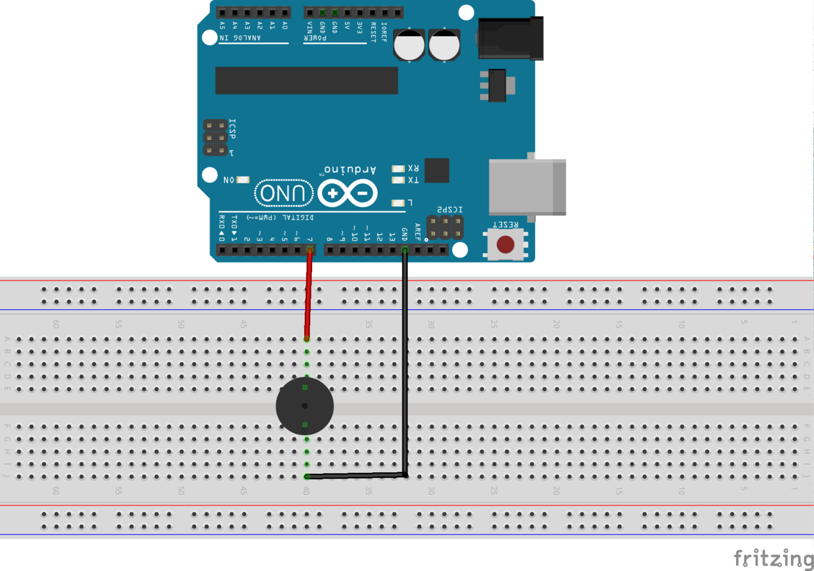
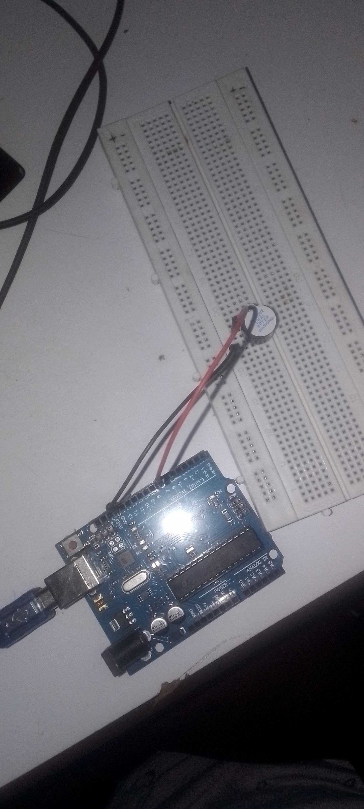

## Active Buzzer

This project demonstrates how to connect an active buzzer to arduino. 

---

### Components Required
1. 1 x Active buzzer
2. 2 x Jumper wires
3. Arduino Uno
4. Breadboard

---

### Circuit Diagram


---
### Circuit Setup


---

### Code
```cpp
int buzzer = 7;
void setup() {
  // put your setup code here, to run once:
  pinMode(buzzer, OUTPUT);
}

void loop() {
  // put your main code here, to run repeatedly:
  digitalWrite(buzzer, HIGH);
  delay(1000);
  digitalWrite(buzzer, LOW);
  delay(1000);
}
