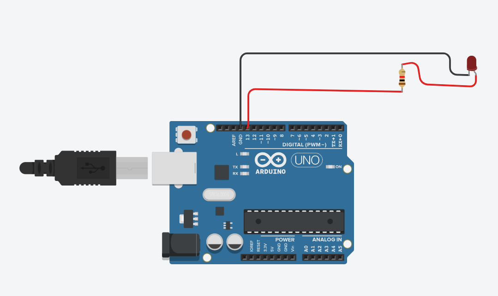

## LED Blink

This project demonstrates how to blink a single LED using an Arduino.  

---

### Components Required
1. LED  
2. Arduino Board  
3. Breadboard (optional)  
4. Jumper wires  
5. 220Ω resistor  

---

### Simulation
You can view and run the simulation here:  
[TinkerCAD link](https://www.tinkercad.com/things/1qtjol9qEeA-led-blinking)

---

### Circuit Diagram


---
### Circuit Setup


---

### Code
```cpp
void setup() {
  pinMode(13, OUTPUT);   // Set pin 13 as output
}

void loop() {
  digitalWrite(13, HIGH); // Turn LED on
  delay(1000);            // Wait 1 second
  digitalWrite(13, LOW);  // Turn LED off
  delay(1000);            // Wait 1 second
}
