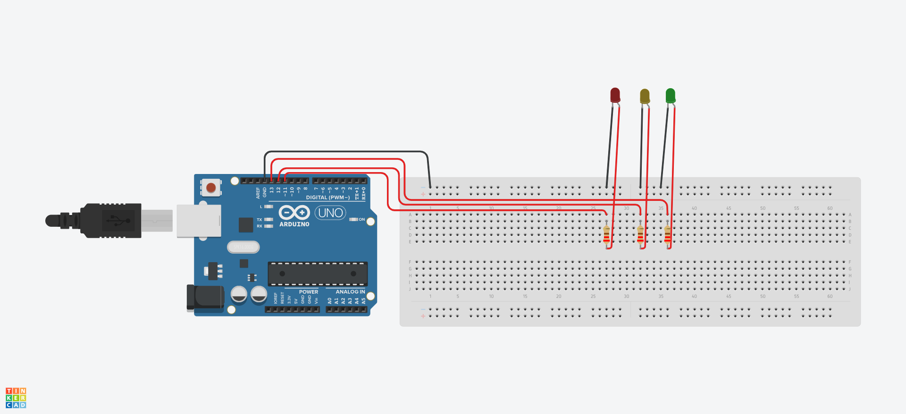

## Multiple LED Blink

This project demonstrates how to blink amultiple LEDs using an Arduino.  

---

### Components Required
1. 3 LEDs  
2. Arduino Board  
3. Breadboard (optional)  
4. Jumper wires  
5. 3 220Ω resistor  

---

### Simulation
You can view and run the simulation here:  
[TinkerCAD link](https://www.tinkercad.com/things/1qtjol9qEeA-led-blinking)

---

### Circuit Diagram


---
### Circuit Setup


---

### Code
```cpp
void setup() {
  pinMode(13, OUTPUT);   // Set pin 13 as output
}

void loop() {
  digitalWrite(13, HIGH); // Turn LED on
  delay(1000);            // Wait 1 second
  digitalWrite(13, LOW);  // Turn LED off
  delay(1000);            // Wait 1 second
}int greenLED = 11;
int yellowLED = 12;
int redLED = 13;

void setup()
{
  pinMode(greenLED, OUTPUT);
  pinMode(yellowLED, OUTPUT);
  pinMode(redLED, OUTPUT);
}

void loop()
{
  digitalWrite(redLED, HIGH);
  delay(1000); 
  digitalWrite(redLED, LOW);
  delay(1000);
  
  digitalWrite(yellowLED, HIGH);
  delay(1000); 
  digitalWrite(yellowLED, LOW);
  delay(1000);
  
  digitalWrite(greenLED, HIGH);
  delay(1000); 
  digitalWrite(greenLED, LOW);
  delay(1000);
}
